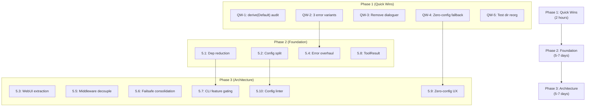
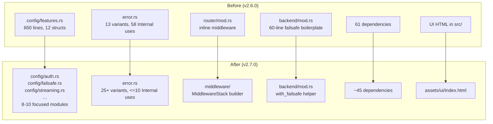
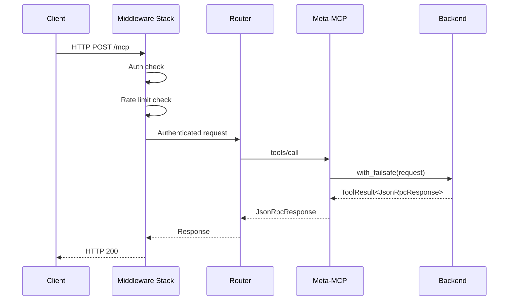

# RFC-0080: Systematic Improvements and Simplifications

**Status**: Proposed
**Authors**: Mikko Parkkola
**Created**: 2026-03-14
**Target**: mcp-gateway v2.7.0
**Codebase**: 218 Rust source files, ~83K LOC, 61 direct dependencies, 2461+ tests

---

## 1. Motivation

mcp-gateway v2.6.0 is feature-complete with Meta-MCP, OAuth 2.1, mTLS, key server,
firewall, cost governance, semantic search, and tool profiles. This RFC addresses
the accumulated structural debt from rapid feature development:

- **61 direct dependencies** -- several are redundant or used in only one place
- **config/features.rs** is a 650-line monolith mixing 12 unrelated domains
- **1417-line index.html** lives inside the Rust source tree
- **58 uses of `Error::Internal(String)`** -- the catch-all variant hides root causes
- **Auth, rate-limit, failsafe, and logging middleware** are wired inline in `router/mod.rs`
- **30+ repeated try/record_failure patterns** in backend request handling
- **parking_lot used in 24 files** despite `std::sync` being sufficient for most

These improvements reduce build time, shrink the dependency tree, improve error
diagnostics, and make the codebase more approachable for contributors.

## 2. Agreement Checklist

- [x] **Scope**: 10 improvements + 5 quick wins targeting codebase simplification
- [x] **Non-scope**: No new features, no protocol changes, no API breaking changes
- [x] **Constraints**: All existing tests must pass; public API (`lib.rs` exports) unchanged
- [x] **Performance**: No regressions; dependency reduction should improve compile time
- [x] **Compatibility**: Config YAML schema must remain backwards-compatible

## 3. Applicable Standards

| Standard | Type | Source |
|----------|------|--------|
| `#![deny(unsafe_code)]` | `[explicit]` | `Cargo.toml` lints section |
| Clippy pedantic warnings | `[explicit]` | `Cargo.toml` lints.clippy |
| Feature-gated modules with `#[cfg(feature = "...")]` | `[explicit]` | `Cargo.toml` features + `lib.rs` |
| `thiserror` for error types | `[explicit]` | `error.rs` |
| `parking_lot::RwLock` for synchronous locks | `[implicit]` | 24 files use it; no documented mandate |
| Manual `Default` impl with serde default fns | `[implicit]` | `config/features.rs` pattern |
| `include_str!` for static assets | `[implicit]` | `gateway/ui/mod.rs` |
| `serde(default)` on all config structs | `[implicit]` | `config/mod.rs`, `config/features.rs` |

## 4. Existing Codebase Analysis

### 4.1 Implementation Path Mapping

| Area | Existing Files | Planned Changes |
|------|---------------|-----------------|
| Dependencies | `Cargo.toml` | Remove/replace 16 deps |
| Config | `src/config/mod.rs` (467L), `src/config/features.rs` (650L) | Split features.rs into focused modules |
| Error handling | `src/error.rs` (110L) | Add context-aware variants |
| Backend | `src/backend/mod.rs` (629L) | Add `with_failsafe` helper |
| Router | `src/gateway/router/mod.rs` (153L) | Extract middleware stack |
| Auth | `src/gateway/auth.rs` (670L) | Move to `gateway/middleware/auth.rs` |
| UI | `src/gateway/ui/` (8 files, 3741L total), `index.html` (1417L) | Extract HTML to `assets/` |
| CLI | `src/cli/mod.rs` (18147B), `src/cli/subcommands.rs` | Feature-gate subcommands |
| Validator | `src/validator/` (incl. `sarif.rs` 365L) | Enhance for standalone CLI |
| Tests | `tests/` (13 files) | Reorganize into `tests/integration/`, `tests/unit/` |

### 4.2 Similar Functionality Search

| Searched Pattern | Result | Decision |
|-----------------|--------|----------|
| `md5::compute` | 1 use in `capability/executor/params.rs` | Replace with `sha2` (already a dep) |
| `quick_xml::Reader` | 1 use in `capability/executor/xml.rs` | Remove dep, inline minimal parser |
| `dialoguer::MultiSelect` | 1 use in `commands/setup.rs` | Replace with simple stdin prompts |
| `open::that` | 1 use in `oauth/client/mod.rs` | Replace with `Command::new("open")` / `xdg-open` |
| `MiddlewareStack` / middleware builder | None found | New implementation justified |
| `ToolResult` wrapper type | None found | New implementation justified |

### 4.3 Code Inspection Evidence

| File | Key Function/Pattern | Relevance |
|------|---------------------|-----------|
| `src/backend/mod.rs:438-498` | `Backend::request()` | Failsafe pattern: can_proceed + retry + record_success/failure |
| `src/failsafe/mod.rs:44-48` | `Failsafe::can_proceed()` | Integration point for failsafe consolidation |
| `src/error.rs:12-67` | `Error` enum (13 variants) | Base for error handling overhaul |
| `src/config/features.rs:1-650` | 12 config structs in one file | Split target |
| `src/config/mod.rs:77-89` | Manual `Default` for `Config` | Already uses `#[derive(Default)]` |
| `src/gateway/router/mod.rs:78-153` | `create_router()` | Middleware wiring inline |
| `src/gateway/ui/mod.rs:1` | `include_str!("index.html")` | Already uses include_str; extraction improves dev UX |
| `src/validator/sarif.rs` (365L) | SARIF output | Already exists; enhance for standalone CLI |
| `src/commands/setup.rs` | `dialoguer::MultiSelect` | Only dialoguer usage |
| `src/oauth/client/mod.rs` | `open::that(&auth_url_str)` | Only `open` crate usage |
| `src/capability/executor/params.rs` | `md5::compute(json.as_bytes())` | Only md5 usage |
| `src/capability/executor/xml.rs` | `quick_xml::Reader` | Only quick-xml usage |

## 5. Detailed Design

### 5.1 Reduce Dependencies (61 -> ~45)

**Effort**: M (2-3 days) | **Impact**: 9/10

#### Removals and Replacements

| Dependency | Current Usage | Action | Replacement |
|-----------|---------------|--------|-------------|
| `md5` | 1 call in `capability/executor/params.rs` | Remove | `sha2::Sha256` (already in deps) |
| `open` | 1 call in `oauth/client/mod.rs` | Remove | `std::process::Command::new("open"/"xdg-open")` |
| `dialoguer` | 1 call in `commands/setup.rs` | Remove | `std::io::stdin()` + simple prompt fn |
| `parking_lot` | 24 files, RwLock + Mutex | Replace | `std::sync::RwLock`, `std::sync::Mutex` |
| `quick-xml` | 1 file in `capability/executor/xml.rs` | Remove | Inline minimal XML text extraction (~40 lines) |
| `pin-project-lite` | Stream impls | Evaluate | May be eliminable with `async-stream` |
| `hmac` + `hex` | Webhook signature verification | Evaluate | Keep if >1 use, consolidate if possible |
| `uuid` `fast-rng` feature | `Uuid::new_v4()` | Simplify | Drop `fast-rng` feature (uses `rand` internally) |

#### parking_lot -> std::sync Migration

`parking_lot` provides two benefits over `std::sync`: (1) no poisoning, (2) slightly
smaller `RwLock`. In practice, none of the 24 usage sites handle poisoning differently --
they all `.unwrap()` or use `.read()` / `.write()` directly. Since `parking_lot` adds
a transitive dependency tree and `std::sync::RwLock` was significantly improved in
Rust 1.80+, the migration is justified.

**Migration strategy**: Replace `parking_lot::RwLock` with `std::sync::RwLock` and
add `.expect("lock poisoned")` at each call site. For `Mutex`, same approach.

Files affected (24):
- `backend/mod.rs`, `config_reload/mod.rs`, `failsafe/circuit_breaker.rs`,
  `failsafe/health.rs`, `failsafe/rate_limiter.rs`, `gateway/streaming.rs`,
  `gateway/meta_mcp/mod.rs`, `gateway/proxy.rs`, `gateway/session_lifecycle.rs`,
  `gateway/server/mod.rs`, `capability/executor/mod.rs`,
  `capability/executor/credentials.rs`, `capability/watcher.rs`,
  `kill_switch/mod.rs`, `scheduler/mod.rs`, `routing_profile/mod.rs`,
  `tool_registry.rs`, `transition.rs`, `transport/stdio.rs`,
  `transport/http/mod.rs`, `cost_accounting/mod.rs`, `oauth/client/mod.rs`

#### Acceptance Criteria

- AC-5.1.1: `cargo tree --depth 1 | wc -l` shows <= 50 direct dependencies
- AC-5.1.2: `md5`, `open`, `dialoguer`, `parking_lot`, `quick-xml` do not appear in `Cargo.toml`
- AC-5.1.3: All 2461+ existing tests pass
- AC-5.1.4: `cargo build --release` time decreases by >= 5% (measure before/after)
- AC-5.1.5: `md5::compute` replaced with `sha2::Sha256` producing hex digest
- AC-5.1.6: OAuth browser open uses `std::process::Command` with platform detection

---

### 5.2 Config Schema Refactor

**Effort**: M (2 days) | **Impact**: 8/10

#### Problem

`config/features.rs` is 650 lines containing 12 unrelated config structs:
`KeyServerConfig`, `CodeModeConfig`, `CacheConfig`, `PlaybooksConfig`,
`WebhookConfig`, `SecurityConfig`, `CapabilityConfig`, `AgentAuthConfig`,
`AuthConfig`, `StreamingConfig`, `FailsafeConfig` (with 4 sub-structs).

Manual `Default` impls with separate `fn default_xxx()` functions (e.g.,
`default_key_server_token_ttl`, `default_max_tokens_per_identity`) could
use `#[derive(Default)]` with `#[serde(default = "...")]` for serde only.

#### Design

Split `config/features.rs` into focused modules:

```
src/config/
  mod.rs          -- Config, ServerConfig, BackendConfig, TransportConfig (existing)
  auth.rs         -- AuthConfig, ApiKeyConfig, AgentAuthConfig, AgentDefinitionConfig
  failsafe.rs     -- FailsafeConfig, CircuitBreakerConfig, RetryConfig, RateLimitConfig, HealthCheckConfig
  streaming.rs    -- StreamingConfig
  security.rs     -- SecurityConfig
  capability.rs   -- CapabilityConfig
  cache.rs        -- CacheConfig
  key_server.rs   -- KeyServerConfig, KeyServerProviderConfig, KeyServerPolicyConfig, etc.
  playbooks.rs    -- PlaybooksConfig
  webhooks.rs     -- WebhookConfig
  code_mode.rs    -- CodeModeConfig
  tests.rs        -- existing
```

Re-exports in `config/mod.rs` maintain API compatibility:
```rust
mod auth;
mod cache;
mod capability;
// ...
pub use auth::*;
pub use cache::*;
pub use capability::*;
```

Use `#[derive(Default)]` where all defaults are type-level (bool=false, Vec=empty,
Option=None) and only keep manual `Default` for structs with non-zero numeric defaults
or computed values. Extract magic numbers into module-level constants:

```rust
const DEFAULT_CIRCUIT_BREAKER_FAILURE_THRESHOLD: u32 = 5;
const DEFAULT_CIRCUIT_BREAKER_SUCCESS_THRESHOLD: u32 = 3;
const DEFAULT_CIRCUIT_BREAKER_RESET_TIMEOUT: Duration = Duration::from_secs(30);
```

#### Acceptance Criteria

- AC-5.2.1: `config/features.rs` no longer exists
- AC-5.2.2: Each new config module is <= 120 lines
- AC-5.2.3: All config types remain importable from `crate::config::*`
- AC-5.2.4: All config deserialization tests pass unchanged
- AC-5.2.5: Default values defined as named constants, not inline literals
- AC-5.2.6: Structs with all-zero/empty/false defaults use `#[derive(Default)]`

---

### 5.3 WebUI Asset Extraction

**Effort**: M (1-2 days) | **Impact**: 7/10

#### Problem

`src/gateway/ui/index.html` (1417 lines of HTML/CSS/JS) is embedded in the Rust
source tree and compiled via `include_str!`. This means:
- Frontend changes require recompilation
- No browser live-reload during UI development
- Source tree mixes concerns (Rust + frontend)

#### Design

Move the file to `assets/ui/index.html`. In release builds, continue using
`include_str!` via a build-time path. In dev mode (debug builds), serve from
disk so frontend developers get instant reload:

```rust
#[cfg(debug_assertions)]
fn load_index_html() -> String {
    // Read from disk for hot-reload in development
    let path = concat!(env!("CARGO_MANIFEST_DIR"), "/assets/ui/index.html");
    std::fs::read_to_string(path).unwrap_or_else(|_| EMBEDDED_HTML.to_string())
}

#[cfg(not(debug_assertions))]
fn load_index_html() -> &'static str {
    include_str!(concat!(env!("CARGO_MANIFEST_DIR"), "/assets/ui/index.html"))
}
```

#### File moves

```
src/gateway/ui/index.html  -->  assets/ui/index.html
```

Update `include_str!` path in `src/gateway/ui/mod.rs`.

#### Acceptance Criteria

- AC-5.3.1: `src/gateway/ui/index.html` no longer exists
- AC-5.3.2: `assets/ui/index.html` contains the full UI HTML
- AC-5.3.3: `cargo build --release` produces identical binary behavior (UI served correctly)
- AC-5.3.4: In debug mode, modifying `assets/ui/index.html` reflects on next page load without recompilation
- AC-5.3.5: Feature gate `#[cfg(feature = "webui")]` continues to work

---

### 5.4 Error Handling Overhaul

**Effort**: L (3-4 days) | **Impact**: 8/10

#### Problem

`Error::Internal(String)` is used 58 times across the codebase as a catch-all.
This loses structured context: you cannot programmatically distinguish an OAuth
initialization failure from a TLS configuration error. Logs show
`"Internal error: Failed to create OAuth HTTP client: ..."` -- the word "Internal"
adds no diagnostic value.

#### Design

Replace the generic `Internal(String)` with 15 context-aware variants while
keeping backwards compatibility (the `Internal` variant remains for truly
unexpected errors):

```rust
#[derive(Error, Debug)]
pub enum Error {
    // --- Existing (unchanged) ---
    #[error("Configuration error: {0}")]
    Config(String),

    #[error("Backend not found: {0}")]
    BackendNotFound(String),

    #[error("Backend unavailable: {0}")]
    BackendUnavailable(String),

    #[error("Backend timeout: {0}")]
    BackendTimeout(String),

    #[error("Transport error: {0}")]
    Transport(String),

    #[error("Protocol error: {0}")]
    Protocol(String),

    #[error("JSON-RPC error {code}: {message}")]
    JsonRpc { code: i32, message: String, data: Option<serde_json::Value> },

    #[error("IO error: {0}")]
    Io(#[from] io::Error),

    #[error("JSON error: {0}")]
    Json(#[from] serde_json::Error),

    #[error("HTTP error: {0}")]
    Http(#[from] reqwest::Error),

    #[error("Server shutdown")]
    Shutdown,

    // --- New context-aware variants ---
    #[error("Config validation: field `{field}` {reason}")]
    ConfigValidation { field: String, reason: String },

    #[error("Circuit open for backend `{backend}`: retry after {remaining_secs}s")]
    CircuitOpen { backend: String, remaining_secs: u64 },

    #[error("Tool `{tool}` not found; similar: {suggestions:?}")]
    ToolNotFound { tool: String, suggestions: Vec<String> },

    #[error("OAuth error for backend `{backend}`: {detail}")]
    OAuth { backend: String, detail: String },

    #[error("TLS error: {0}")]
    Tls(String),

    #[error("Rate limited: {0}")]
    RateLimited(String),

    #[error("Authentication failed: {0}")]
    AuthFailed(String),

    #[error("Authorization denied: {0}")]
    AuthzDenied(String),

    #[error("Capability error in `{capability}`: {detail}")]
    Capability { capability: String, detail: String },

    #[error("Webhook error: {0}")]
    Webhook(String),

    #[error("Plugin error: {0}")]
    Plugin(String),

    #[error("Validation error: {0}")]
    Validation(String),

    #[error("Concurrency limit reached for `{backend}`")]
    ConcurrencyLimit { backend: String },

    #[error("Session error: {0}")]
    Session(String),

    // --- Catch-all (reduced usage target: <10) ---
    #[error("Internal error: {0}")]
    Internal(String),
}
```

Update `to_rpc_code()` to map new variants to appropriate JSON-RPC codes.

#### Migration Strategy

Migrate `Error::Internal(...)` call sites in priority order:
1. OAuth calls (18 uses) -> `Error::OAuth { backend, detail }`
2. TLS calls (2 uses) -> `Error::Tls(...)`
3. Config validation (3 uses) -> `Error::ConfigValidation { field, reason }`
4. Concurrency (1 use) -> `Error::ConcurrencyLimit { backend }`
5. Remaining -> evaluate per-site

#### Acceptance Criteria

- AC-5.4.1: `Error` enum has >= 25 variants (13 existing + 12+ new)
- AC-5.4.2: `rg "Error::Internal" src/ | wc -l` returns <= 10 (from current 58)
- AC-5.4.3: Each new variant maps to an appropriate JSON-RPC error code in `to_rpc_code()`
- AC-5.4.4: All existing error-handling tests pass
- AC-5.4.5: New variants have doc comments explaining when to use them
- AC-5.4.6: `Error::CircuitOpen` includes `remaining_secs` for client retry-after headers

---

### 5.5 Middleware Decoupling

**Effort**: L (3-4 days) | **Impact**: 7/10

#### Problem

`gateway/router/mod.rs` wires auth, agent-auth, panic-catching, compression,
and tracing middleware inline in `create_router()`. Adding or reordering
middleware requires editing the router function. There is no way to compose
middleware stacks differently for testing vs production.

#### Design

Create `gateway/middleware/` module with:

```
src/gateway/middleware/
  mod.rs          -- MiddlewareStack builder
  auth.rs         -- move from gateway/auth.rs
  agent_auth.rs   -- extract from gateway/oauth/
  rate_limit.rs   -- extract rate-limit logic
  failsafe.rs     -- circuit breaker + retry check layer
  logging.rs      -- request/response logging layer
```

The `MiddlewareStack` builder:

```rust
pub struct MiddlewareStack {
    layers: Vec<Box<dyn Layer<...>>>,
}

impl MiddlewareStack {
    pub fn production(state: &AppState) -> Self { /* full stack */ }
    pub fn testing(state: &AppState) -> Self { /* no auth, no rate-limit */ }
    pub fn apply(self, router: Router) -> Router { /* chain layers */ }
}
```

`create_router()` becomes:

```rust
pub fn create_router(state: Arc<AppState>) -> Router {
    let routes = /* route definitions */;
    let stack = MiddlewareStack::production(&state);
    stack.apply(routes).with_state(state)
}
```

#### Integration Points

```yaml
Integration Point 1:
  Existing Component: gateway/router/mod.rs::create_router()
  Integration Method: Replace inline .layer() calls with MiddlewareStack
  Impact Level: High (Process Flow Change)
  Required Test Coverage: Router integration tests must pass unchanged

Integration Point 2:
  Existing Component: gateway/auth.rs (670 lines)
  Integration Method: Move to gateway/middleware/auth.rs
  Impact Level: Medium (File relocation)
  Required Test Coverage: Auth middleware tests pass
```

#### Acceptance Criteria

- AC-5.5.1: `gateway/middleware/` directory exists with >= 4 modules
- AC-5.5.2: `gateway/auth.rs` moved to `gateway/middleware/auth.rs`
- AC-5.5.3: `create_router()` uses `MiddlewareStack` builder pattern
- AC-5.5.4: `MiddlewareStack::testing()` creates a stack without auth middleware
- AC-5.5.5: All router and auth tests pass
- AC-5.5.6: Public re-exports (`gateway::AuthState`, etc.) remain unchanged

---

### 5.6 Failsafe Pattern Consolidation

**Effort**: M (1-2 days) | **Impact**: 7/10

#### Problem

`Backend::request()` (lines 438-498 of `backend/mod.rs`) contains 60 lines of
failsafe boilerplate: check `can_proceed()`, acquire semaphore, `ensure_started()`,
get transport, `with_retry()`, measure latency, `record_success()` / `record_failure()`.
Any new backend operation (e.g., `get_tools`, `get_resources`) that needs failsafe
protection must duplicate this pattern.

#### Design

Add a `with_failsafe` method to `Backend`:

```rust
impl Backend {
    /// Execute an operation with full failsafe protection.
    ///
    /// Checks circuit breaker, acquires concurrency permit, ensures transport
    /// is started, retries on transient failure, and records success/failure
    /// metrics.
    pub async fn with_failsafe<F, Fut, R>(&self, op_name: &str, f: F) -> Result<R>
    where
        F: FnMut(Arc<dyn Transport>) -> Fut,
        Fut: std::future::Future<Output = Result<R>>,
    {
        // 1. Circuit breaker check
        if !self.failsafe.can_proceed() {
            return Err(Error::CircuitOpen { ... });
        }
        // 2. Semaphore acquire
        let _permit = self.semaphore.acquire().await?;
        // 3. Ensure started
        self.ensure_started().await?;
        // 4. Get transport
        let transport = self.get_transport()?;
        // 5. Retry wrapper
        let start = Instant::now();
        let result = with_retry(&self.failsafe.retry_policy, &self.name, || {
            f(Arc::clone(&transport))
        }).await;
        // 6. Record metrics
        match &result {
            Ok(_) => self.failsafe.record_success(start.elapsed()),
            Err(_) => self.failsafe.record_failure(),
        }
        result
    }
}
```

Then `Backend::request()` becomes:

```rust
pub async fn request(&self, method: &str, params: Option<Value>) -> Result<JsonRpcResponse> {
    let method = method.to_string();
    let params = params.clone();
    self.with_failsafe("request", |transport| {
        let m = method.clone();
        let p = params.clone();
        async move { transport.request(&m, p).await }
    }).await
}
```

#### Acceptance Criteria

- AC-5.6.1: `Backend::with_failsafe()` method exists and is public
- AC-5.6.2: `Backend::request()` delegates to `with_failsafe()`
- AC-5.6.3: `with_failsafe` checks circuit breaker, acquires semaphore, retries, records metrics
- AC-5.6.4: All backend request tests pass
- AC-5.6.5: Failsafe behavior (circuit open, retry, rate limit) is identical to current

---

### 5.7 CLI Feature Gating

**Effort**: M (2 days) | **Impact**: 6/10

#### Problem

All CLI subcommands are compiled even when unused. A minimal gateway build
(`--no-default-features`) still compiles Cap, Tool, TLS, Discover subcommands
and their dependencies (dialoguer, rcgen, x509-parser, etc.).

#### Design

Add a `cli-full` feature that gates non-essential subcommands:

```toml
[features]
default = ["webui", "config-export", "cost-governance", "firewall",
           "discovery", "semantic-search", "tool-profiles", "cli-full"]
cli-full = []
core = []  # alias: --features core gives minimal gateway
```

In `src/cli/mod.rs` and `src/main.rs`, gate subcommands:

```rust
#[cfg(feature = "cli-full")]
Cap(CapCommand),
#[cfg(feature = "cli-full")]
Tool(ToolCommand),
#[cfg(feature = "cli-full")]
Tls(TlsCommand),
```

#### Acceptance Criteria

- AC-5.7.1: `cargo build --no-default-features` compiles without Cap/Tool/TLS subcommands
- AC-5.7.2: `cargo build` (default features) includes all subcommands
- AC-5.7.3: `mcp-gateway serve` works with `--no-default-features`
- AC-5.7.4: `mcp-gateway --help` shows only available subcommands for the feature set

---

### 5.8 ToolResult Wrapper

**Effort**: S (1 day) | **Impact**: 6/10

#### Problem

Tool responses lack consistent metadata. Different code paths return raw
`JsonRpcResponse` or `serde_json::Value` with no standard envelope for
timing, caching status, or backend provenance.

#### Design

```rust
/// Standardized tool result envelope.
#[derive(Debug, Clone, Serialize, Deserialize)]
pub struct ToolResult<T> {
    /// Whether the operation succeeded.
    pub success: bool,
    /// The result payload (present on success).
    #[serde(skip_serializing_if = "Option::is_none")]
    pub data: Option<T>,
    /// Error message (present on failure).
    #[serde(skip_serializing_if = "Option::is_none")]
    pub error: Option<String>,
    /// Response metadata.
    pub metadata: ToolResultMetadata,
}

#[derive(Debug, Clone, Serialize, Deserialize)]
pub struct ToolResultMetadata {
    /// Wall-clock time in milliseconds.
    pub took_ms: u64,
    /// Whether this response was served from cache.
    pub cached: bool,
    /// Which backend served this request.
    pub backend: String,
}
```

Use internally in meta-MCP helpers and gateway proxy. The JSON-RPC response
format is unchanged externally -- `ToolResult` is an internal convenience type
that is serialized into the `result` field of `JsonRpcResponse`.

#### Acceptance Criteria

- AC-5.8.1: `ToolResult<T>` and `ToolResultMetadata` types exist in `src/protocol/types.rs`
- AC-5.8.2: Meta-MCP `gateway_execute` returns `ToolResult` internally
- AC-5.8.3: `took_ms` is populated from request duration
- AC-5.8.4: `cached` is `true` when response served from cache
- AC-5.8.5: External JSON-RPC wire format is unchanged

---

### 5.9 Zero-Config UX

**Effort**: M (1-2 days) | **Impact**: 7/10

#### Problem

`mcp-gateway serve` requires `--config path/to/config.yaml`. Without it,
`Config::load(None)` works but users do not know this. There is no automatic
config discovery from standard locations.

#### Design

Config discovery chain in `Config::load()`:

```
1. Explicit --config path  (highest priority)
2. $MCP_GATEWAY_CONFIG env var
3. ./mcp-gateway.yaml (current directory)
4. $HOME/.mcp-gateway/config.yaml
5. In-memory defaults (no file needed)
```

For step 5, `mcp-gateway serve` without `--config` prints a helpful message:

```
INFO No config file found. Running with defaults (port 39400, no backends).
     Create a config: mcp-gateway init
     Or specify one:  mcp-gateway serve --config path/to/config.yaml
```

Additionally, `mcp-gateway init --wizard` (already exists as `setup wizard`)
creates an interactive config at `$HOME/.mcp-gateway/config.yaml`.

#### Acceptance Criteria

- AC-5.9.1: `mcp-gateway serve` without `--config` starts successfully with defaults
- AC-5.9.2: Config is discovered from `$HOME/.mcp-gateway/config.yaml` if it exists
- AC-5.9.3: `$MCP_GATEWAY_CONFIG` env var is respected
- AC-5.9.4: Info-level log message explains which config source was used
- AC-5.9.5: `mcp-gateway init` creates config at the specified output path (existing behavior preserved)

---

### 5.10 Standalone Config Linter

**Effort**: M (2 days) | **Impact**: 6/10

#### Problem

Config validation happens at server startup. CI pipelines cannot validate
config files without starting (and immediately stopping) the gateway.
The validator CLI (`mcp-gateway validate`) exists but SARIF output
(365-line `sarif.rs`) could be enhanced for CI integration.

#### Design

Enhance the existing `mcp-gateway validate` command:

1. Support `--format sarif` for CI/CD integration (already partially exists)
2. Add `--strict` mode that treats warnings as errors
3. Support validating multiple config files in one invocation
4. Add `--schema` flag to output JSON Schema for editor integration
5. Exit code: 0 = valid, 1 = errors, 2 = warnings (with `--strict`)

#### Acceptance Criteria

- AC-5.10.1: `mcp-gateway validate config.yaml --format sarif` outputs valid SARIF JSON
- AC-5.10.2: `mcp-gateway validate --strict` exits with code 2 on warnings
- AC-5.10.3: Multiple config paths can be validated in one invocation
- AC-5.10.4: Exit codes are 0/1/2 as specified
- AC-5.10.5: SARIF output includes rule IDs, severity levels, and file locations

---

## 6. Quick Wins (< 1 hour each)

### QW-1: derive(Default) on Config Structs (10 min)

**Current**: 8 config structs have manual `Default` impls where `#[derive(Default)]`
would suffice (all defaults are zero/false/empty).

**Target structs**: `CodeModeConfig` (already done), `AgentAuthConfig` (already done),
`PolicyMatchConfig` (already done), `PolicyScopesConfig` (already done).

Remaining candidates: `WebhookConfig` (has non-zero `rate_limit: 100`),
`SecurityConfig` (has `true` defaults) -- these need manual `Default`. No change needed.

**Actual action**: Verify current state is optimal; document as already completed.

#### Acceptance Criteria
- AC-QW1.1: All config structs where all defaults are zero/false/empty use `#[derive(Default)]`

### QW-2: Three Specific Error Variants (30 min)

Add `Error::OAuth`, `Error::Tls`, `Error::RateLimited` as Phase 1 of the
error overhaul (improvement 5.4). These three cover 22 of the 58
`Error::Internal` uses.

#### Acceptance Criteria
- AC-QW2.1: `Error::OAuth`, `Error::Tls`, `Error::RateLimited` variants exist
- AC-QW2.2: At least 20 `Error::Internal` call sites migrated to new variants

### QW-3: Remove dialoguer Dependency (45 min)

Replace the single `dialoguer::MultiSelect` usage in `commands/setup.rs`
with a simple numbered-list stdin prompt.

#### Acceptance Criteria
- AC-QW3.1: `dialoguer` removed from `Cargo.toml`
- AC-QW3.2: `mcp-gateway setup wizard` still offers interactive server selection
- AC-QW3.3: Build succeeds without `dialoguer`

### QW-4: Zero-Config Fallback (20 min)

Make `Config::load(None)` check `$HOME/.mcp-gateway/config.yaml` before
falling back to in-memory defaults. (Phase 1 of improvement 5.9.)

#### Acceptance Criteria
- AC-QW4.1: `Config::load(None)` checks `$HOME/.mcp-gateway/config.yaml`
- AC-QW4.2: If file does not exist, returns `Config::default()` without error

### QW-5: Test Directory Reorganization (15 min)

Move integration test files into `tests/integration/` subdirectory.

```
tests/integration_tests.rs  -->  tests/integration/mod.rs
tests/auth_tests.rs         -->  tests/integration/auth.rs
tests/backend_tests.rs      -->  tests/integration/backend.rs
...
```

#### Acceptance Criteria
- AC-QW5.1: `tests/integration/` directory contains all integration test files
- AC-QW5.2: `cargo test` discovers and runs all tests
- AC-QW5.3: No test files remain in `tests/` root (except `tests/integration/mod.rs`)

---

## 7. Implementation Phases

### Phase Dependency Diagram



### Phase 1: Quick Wins (2 hours, no dependencies)

| Task | Effort | Verification |
|------|--------|-------------|
| QW-1: derive(Default) audit | 10 min | L2: Compile check |
| QW-2: 3 error variants | 30 min | L2: Tests pass |
| QW-3: Remove dialoguer | 45 min | L2: Build + test |
| QW-4: Zero-config fallback | 20 min | L2: Unit test |
| QW-5: Test dir reorg | 15 min | L2: `cargo test` |

### Phase 2: Foundation (5-7 days)

| Task | Effort | Dependencies | Verification |
|------|--------|-------------|-------------|
| 5.1: Dependency reduction | 2-3 days | QW-3 done | L2: All tests pass, dep count <= 50 |
| 5.2: Config schema refactor | 2 days | None | L2: Config tests pass, each module <= 120 lines |
| 5.4: Error overhaul (full) | 3-4 days | QW-2 done | L2: Internal usage <= 10 |
| 5.8: ToolResult wrapper | 1 day | None | L2: New type tests pass |

### Phase 3: Architecture (5-7 days)

| Task | Effort | Dependencies | Verification |
|------|--------|-------------|-------------|
| 5.3: WebUI asset extraction | 1-2 days | None | L1: UI loads correctly |
| 5.5: Middleware decoupling | 3-4 days | None | L1: All routes functional |
| 5.6: Failsafe consolidation | 1-2 days | 5.4 done | L2: Backend tests pass |
| 5.7: CLI feature gating | 2 days | 5.1 done | L1: `--no-default-features` builds |
| 5.9: Zero-config UX (full) | 1-2 days | QW-4 done | L1: `serve` without config works |
| 5.10: Config linter | 2 days | 5.2 done | L1: SARIF output validates |

## 8. Change Impact Map

```yaml
5.1 Dependency Reduction:
  Change Target: Cargo.toml, 24+ source files (parking_lot migration)
  Direct Impact:
    - Cargo.toml (dependency removals)
    - capability/executor/params.rs (md5 -> sha2)
    - capability/executor/xml.rs (quick-xml -> inline)
    - oauth/client/mod.rs (open -> std::process::Command)
    - commands/setup.rs (dialoguer -> stdin)
    - 24 files (parking_lot -> std::sync)
  Indirect Impact:
    - Build time (expected decrease)
    - Binary size (expected decrease)
  No Ripple Effect:
    - Protocol handling (unchanged)
    - Config schema (unchanged)
    - API surface (unchanged)

5.2 Config Schema Refactor:
  Change Target: config/features.rs -> config/{auth,failsafe,...}.rs
  Direct Impact:
    - config/features.rs (deleted)
    - config/mod.rs (new module declarations + re-exports)
    - 8-10 new config module files
  Indirect Impact:
    - None (re-exports maintain API compatibility)
  No Ripple Effect:
    - All callers using crate::config::* (unchanged due to re-exports)

5.3 WebUI Asset Extraction:
  Change Target: src/gateway/ui/index.html -> assets/ui/index.html
  Direct Impact:
    - gateway/ui/mod.rs (update include_str! path)
    - assets/ui/index.html (new location)
  Indirect Impact:
    - None
  No Ripple Effect:
    - All other UI modules (backend_ops, backends, capabilities, etc.)

5.4 Error Handling Overhaul:
  Change Target: error.rs + 58 call sites
  Direct Impact:
    - error.rs (new variants)
    - oauth/client/mod.rs (18 Error::Internal -> Error::OAuth)
    - gateway/server/ (2 Error::Internal -> Error::Tls)
    - backend/mod.rs (Error::Internal -> specific variants)
  Indirect Impact:
    - Any match arms on Error enum (new arms needed)
  No Ripple Effect:
    - JSON-RPC wire format (error codes remapped transparently)

5.5 Middleware Decoupling:
  Change Target: gateway/router/mod.rs, gateway/auth.rs
  Direct Impact:
    - gateway/middleware/ (new module)
    - gateway/router/mod.rs (simplified)
    - gateway/auth.rs (moved)
  Indirect Impact:
    - gateway/mod.rs (new module declaration)
  No Ripple Effect:
    - All handler functions (unchanged)
    - Route definitions (unchanged)

5.6 Failsafe Pattern Consolidation:
  Change Target: backend/mod.rs
  Direct Impact:
    - backend/mod.rs (new with_failsafe method, simplified request())
  Indirect Impact:
    - None (internal refactor)
  No Ripple Effect:
    - Backend public API (unchanged)
    - Failsafe module (unchanged)

5.7 CLI Feature Gating:
  Change Target: Cargo.toml, cli/mod.rs, main.rs
  Direct Impact:
    - Cargo.toml (new cli-full feature)
    - cli/mod.rs (cfg gates on subcommands)
    - main.rs (cfg gates on match arms)
  Indirect Impact:
    - Build matrix (CI needs to test with/without cli-full)
  No Ripple Effect:
    - Library crate (unchanged)

5.8 ToolResult Wrapper:
  Change Target: protocol/types.rs
  Direct Impact:
    - protocol/types.rs (new types)
    - gateway/meta_mcp_helpers.rs (use ToolResult internally)
  Indirect Impact:
    - None (internal type, wire format unchanged)
  No Ripple Effect:
    - External API (JSON-RPC format unchanged)

5.9 Zero-Config UX:
  Change Target: config/mod.rs, main.rs
  Direct Impact:
    - config/mod.rs (Config::load discovery chain)
    - main.rs (logging for config source)
  Indirect Impact:
    - None
  No Ripple Effect:
    - Existing --config behavior (unchanged)

5.10 Standalone Config Linter:
  Change Target: validator/cli_handler.rs, validator/sarif.rs
  Direct Impact:
    - validator/cli_handler.rs (enhanced options)
    - validator/sarif.rs (enhanced SARIF output)
    - cli/mod.rs (updated validate subcommand args)
  Indirect Impact:
    - None
  No Ripple Effect:
    - Runtime validation (unchanged)
```

## 9. Integration Boundary Contracts

```yaml
Boundary: Config Module Re-exports
  Input: External code imports crate::config::FooConfig
  Output: Same types, same derive traits, same serde behavior (sync)
  On Error: Compile error if re-export missing -- caught at build time

Boundary: Error Enum Extension
  Input: Code constructs Error::OAuth { backend, detail }
  Output: Error Display, Debug, to_rpc_code() (sync)
  On Error: Exhaustive match warnings catch missing arms at compile time

Boundary: MiddlewareStack -> Router
  Input: MiddlewareStack::production(state) / MiddlewareStack::testing(state)
  Output: Configured Router with all layers applied (sync)
  On Error: Compile error if layer types mismatch

Boundary: Backend::with_failsafe
  Input: Async closure receiving Arc<dyn Transport>
  Output: Result<R> after failsafe checks and retries (async)
  On Error: Error::CircuitOpen, Error::ConcurrencyLimit, or inner error propagated
```

## 10. Risk Assessment

| Risk | Likelihood | Impact | Mitigation |
|------|-----------|--------|------------|
| parking_lot -> std::sync performance regression | Low | Medium | Benchmark before/after; std::sync improved significantly in Rust 1.80+ |
| Config split breaks deserialization | Low | High | Serde tests exercise all paths; re-exports ensure API compatibility |
| Middleware reordering changes auth behavior | Medium | High | Keep exact same layer order; integration tests cover auth flows |
| Error variant additions break downstream matches | Low | Low | Adding variants is non-breaking; wildcard `_` arms handle it |
| WebUI asset path breaks in release builds | Low | High | CI tests both debug and release builds for UI serving |
| Feature-gated CLI confuses users | Low | Medium | Clear error message: "This subcommand requires feature X" |

## 11. Implementation Approach

**Selected**: Hybrid (Phase 1 vertical quick wins + Phase 2-3 horizontal foundation-then-architecture)

**Rationale**: Quick wins deliver immediate value with minimal risk. Foundation
improvements (deps, config, errors) must precede architecture changes that
depend on them (middleware decoupling needs new error variants; CLI feature
gating needs dependency reduction).

**Verification levels**:
- Phase 1: L2 (tests pass for each quick win)
- Phase 2: L2 (full test suite green after each improvement)
- Phase 3: L1 (end-to-end functional verification)

## 12. Complexity Assessment

- **complexity_level**: medium
- **complexity_rationale**:
  1. Requirements/ACs: 10 improvements with clear, measurable ACs; no ambiguous business logic
  2. Constraints/risks: parking_lot migration touches 24 files but is mechanical; middleware reordering requires careful layer-order preservation; config split is safe due to re-exports

## 13. Architecture Diagram



## 14. Data Flow (Unchanged)

The request data flow remains identical. All improvements are structural
(code organization, error types, dependency management) -- no data flow changes.



## 15. Summary

| # | Improvement | Effort | Impact | Phase |
|---|------------|--------|--------|-------|
| QW-1 | derive(Default) audit | 10 min | -- | 1 |
| QW-2 | 3 error variants | 30 min | -- | 1 |
| QW-3 | Remove dialoguer | 45 min | -- | 1 |
| QW-4 | Zero-config fallback | 20 min | -- | 1 |
| QW-5 | Test dir reorg | 15 min | -- | 1 |
| 5.1 | Reduce deps 61->~45 | M (2-3d) | 9 | 2 |
| 5.2 | Config schema refactor | M (2d) | 8 | 2 |
| 5.3 | ~~WebUI asset extraction~~ | -- | -- | Dropped (already separate file) |
| 5.4 | Error handling overhaul | L (3-4d) | 8 | 2 |
| 5.5 | ~~Middleware decoupling~~ | -- | -- | Dropped (already decoupled) |
| 5.6 | ~~Failsafe consolidation~~ | -- | -- | Dropped (only 3 callsites) |
| 5.7 | CLI feature gating (complete existing) | M (2d) | 6 | 3 |
| 5.8 | ToolResult wrapper (new feature, protocol risk) | S (1d) | 6 | 3 (last) |
| 5.9 | Config path discovery (reframed) | S (1d) | 7 | 3 |
| 5.10 | gateway.yaml validation (reframed) | M (2d) | 6 | 3 |
| M1 | Backend cache consolidation (8 RwLocks→1) | M (1-2d) | 8 | 2 |
| M2 | Auth struct split (config vs state) | M (1d) | 7 | 2 |

**Total estimated effort**: 3-4 weeks (one developer)
**Total files affected**: ~60 (of 218 source files)
**Risk level**: Low-Medium (all changes are internal; no API/wire format changes)

## 16. Codex GPT-5.4 Review Corrections

Independent review by Codex GPT-5.4 identified several corrections to the original
analysis. These are incorporated into the plan:

### Validated ✅
- **5.1** (dep reduction): md5/open/dialoguer each have 1 callsite — confirmed removable
- **5.4** (error handling): 58 `Internal(String)` uses confirmed; highest-value refactor
- **5.2** (config split): 650-line features.rs confirmed; module split is valid

### Corrected ⚠️
- **5.1 (parking_lot)**: 17+ files, mechanical swap but `dashmap` keeps parking_lot
  as transitive dep anyway. Net benefit is code simplification, not dep removal.
- **5.1 (uuid+rand)**: Cannot merge — `rand` is used directly in 4 files for crypto
  RNG (`rand::rng().random::<[u8;32]>()`). Drop this sub-item.
- **5.2 (derive Default)**: Most manual `impl Default` blocks are **intentional** —
  they set domain-meaningful non-zero values (e.g., `failure_threshold: 5`). QW-1
  scope is smaller than initially estimated.
- **5.7 (CLI gating)**: Already partially done — `config-export` and `webui` features
  already gate subcommands. This completes an existing pattern.
- **5.9 (zero-config)**: `Config::load(None)` already works with defaults. Setup wizard
  already exists. Missing piece is **config path discovery** only.
- **5.10 (config linter)**: `validate` command with SARIF **already exists** for
  capability files. Reframed as: extend to validate `gateway.yaml` schema.

### Misconceptions ❌ (deprioritized or reframed)
- **5.3 (WebUI extraction)**: HTML is already a separate file loaded via `include_str!`.
  Reframed as: move from `src/gateway/ui/index.html` to `assets/ui/index.html` —
  cosmetic reorganization only.
- **5.5 (Middleware decoupling)**: Auth is already in `gateway/auth.rs`, failsafe in
  `src/failsafe/`. Already decoupled. Reframed as: split 700-line `auth.rs` into
  immutable config vs mutable rate-limiter state (new finding M2).
- **5.6 (Failsafe consolidation)**: Only 3 `Backend::new` callsites, not 30+.
  Minor cleanup, not architectural. Deprioritized to P4.
- **5.8 (ToolResult wrapper)**: This is a **new feature**, not a refactor. Risk of
  breaking MCP protocol wire format. Must verify protocol compliance first.
  Moved to Phase 3 (last).

### New Improvements Found by Codex (added)
- **M1**: Backend has 8 separate RwLock fields for cache — consolidate into single
  `CacheState` struct under one lock. High impact on Backend complexity.
- **M2**: `auth.rs` (700 lines) mixes immutable `ResolvedAuthConfig` with mutable
  `DashMap<String, ClientRateLimiter>`. Split into config + state.
- **M3**: Config path discovery: check `./gateway.yaml` → `~/.config/mcp-gateway/`
  → defaults. Currently no search path.
- **M4**: `main.rs` is 627 lines with `#[allow(too_many_lines)]` suppression.

### Revised Phase Ordering (post-review)

**Phase 1 — Quick Wins** (unchanged): QW-1 through QW-5
**Phase 2 — Foundation**: 5.1 (deps, minus uuid+rand), 5.2 (config split), 5.4 (errors), M1 (cache consolidation), M2 (auth split)
**Phase 3 — Architecture**: M3 (path discovery), 5.7 (CLI gating), 5.10 (gateway.yaml validation), 5.8 (ToolResult — last, highest risk)
**Dropped**: 5.3 (cosmetic only), 5.5 (already done), 5.6 (3 callsites)

## 17. References

- [Rust std::sync::RwLock improvements (1.80+)](https://blog.rust-lang.org/2024/07/25/Rust-1.80.0.html) -- Improved fairness and performance
- [SARIF specification v2.1.0](https://docs.oasis-open.org/sarif/sarif/v2.1.0/sarif-v2.1.0.html) -- Static Analysis Results Interchange Format
- [Axum middleware documentation](https://docs.rs/axum/latest/axum/middleware/index.html) -- Layer composition patterns
- [thiserror best practices](https://docs.rs/thiserror/latest/thiserror/) -- Derive macro for error types
