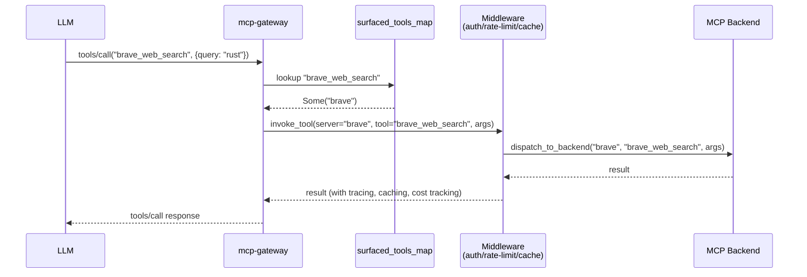
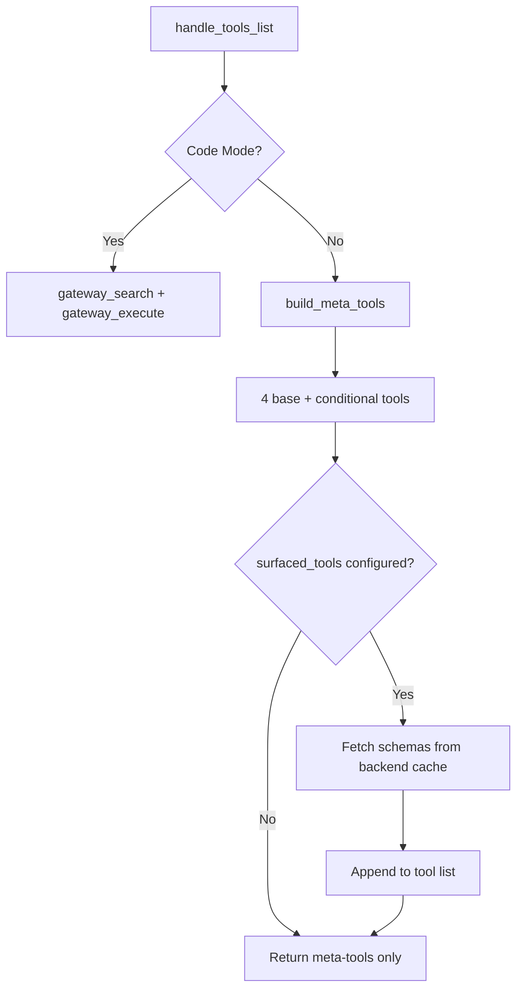
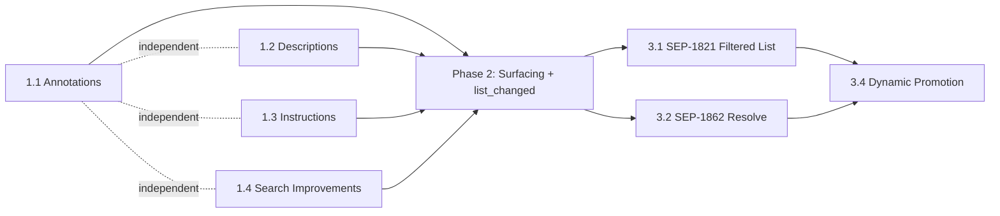

# RFC-0081: Intelligent Tool Surfacing and MCP Spec Alignment

**Status**: Proposed
**Authors**: Mikko Parkkola
**Created**: 2026-03-14
**Target**: mcp-gateway v2.7.0 (Phase 1-2), v2.8.0 (Phase 3)
**Codebase**: 218 Rust source files, ~83K LOC, 2461+ tests

---

## 1. Problem Statement

When mcp-gateway coexists alongside directly-connected MCP servers, LLMs prefer
direct tools (full schemas visible in `tools/list`, one-hop invocation) over
gateway meta-tools (two-hop discovery via `gateway_search_tools` then
`gateway_invoke`). The gateway's core value proposition is ~95% context token
savings through the Meta-MCP pattern -- exposing 4-15 meta-tools instead of 150+
full tool schemas.

We cannot expose all backend tools directly (this destroys the token-savings
value prop), but we must compete in mixed environments where direct MCP servers
are also connected.

### Specific Weaknesses

1. **Meta-tool descriptions are functional, not persuasive** -- "Search for tools
   across all backends by keyword" does not communicate the value of ~95% token
   savings or the breadth of 150+ tools across 20+ servers.

2. **Initialize instructions mention meta-tools but do not emphasize the
   discovery-first pattern** -- LLMs default to tools they can see full schemas
   for.

3. **Tool annotations are absent** -- `readOnlyHint`, `openWorldHint`,
   `outputSchema` are all `None` on discovery meta-tools, giving LLM routing
   heuristics no signal.

4. **Search returns no suggestions on tool-not-found in `gateway_invoke`** --
   when an LLM guesses a tool name wrong, the error is opaque with no recovery
   path.

5. **No way to "pin" high-value tools** -- operators know which tools are most
   important but cannot surface them directly alongside meta-tools.

6. **Gateway advertises `listChanged: true` but never sends
   `notifications/tools/list_changed`** -- a spec compliance gap.

---

## 2. Agreement Checklist

- [x] **Scope**: Three phases -- annotations/search (P1), static surfacing (P2),
  MCP spec alignment (P3)
- [x] **Non-scope**: No changes to the core Meta-MCP dispatch pattern; no
  changes to auth, rate-limit, or firewall middleware; no UI changes
- [x] **Constraints**: All existing 2461+ tests must pass; config YAML schema
  must remain backwards-compatible (new fields are additive); Phase 3 behind
  feature flags
- [x] **Performance**: No measurable latency increase for `tools/list` or
  `tools/call`; surfaced tool routing adds one `HashMap` lookup
- [x] **Compatibility**: MCP 2025-11-25 spec compliance; SEP-1821/1862
  implementations behind feature flags until specs merge

---

## 3. Applicable Standards

| Standard | Type | Source |
|----------|------|--------|
| `#![deny(unsafe_code)]` | `[explicit]` | `Cargo.toml` lints section |
| Clippy pedantic warnings | `[explicit]` | `Cargo.toml` lints.clippy |
| Feature-gated modules with `#[cfg(feature = "...")]` | `[explicit]` | `Cargo.toml` features + `lib.rs` |
| `Tool` struct with `title`, `annotations`, `output_schema` fields | `[explicit]` | `src/protocol/types.rs:10-28` |
| `ToolAnnotations` with `readOnlyHint`, `openWorldHint` | `[explicit]` | `src/protocol/types.rs:31-48` |
| `serde(default)` on all config structs | `[implicit]` | `config/mod.rs`, `config/features.rs` |
| Tool definitions separated in `meta_mcp_tool_defs.rs` | `[implicit]` | Module structure comment in `meta_mcp/mod.rs:1-8` |
| `build_meta_tools()` assembles tools conditionally via boolean flags | `[implicit]` | `meta_mcp_tool_defs.rs:376-403` |
| `SearchRanker` with synonym expansion and usage-weighted scoring | `[implicit]` | `ranking/mod.rs` |

---

## 4. Existing Codebase Analysis

### 4.1 Implementation Path Mapping

| Area | Existing File | Current State | Planned Changes |
|------|--------------|---------------|-----------------|
| Tool annotations | `src/gateway/meta_mcp_tool_defs.rs` | All meta-tools have `annotations: None` | Add `ToolAnnotations` to discovery/search tools |
| Tool descriptions | `src/gateway/meta_mcp_tool_defs.rs` | Functional descriptions | Rewrite with value-selling language + dynamic counts |
| Initialize instructions | `src/gateway/meta_mcp_helpers.rs:74-81` | Static 4-line preamble | Dynamic preamble with tool/server counts |
| Search ranking | `src/ranking/mod.rs` | 12 synonym groups, no schema param ranking | Expand to 20+ groups, add schema param boost |
| Invoke error path | `src/gateway/meta_mcp/mod.rs:467-470` | Generic "Unknown tool" error | Tool name suggestions via Levenshtein distance |
| Config (MetaMcpConfig) | `src/config/mod.rs:250-261` | 4 fields: enabled, cache_tools, cache_ttl, warm_start | Add `surfaced_tools: Vec<SurfacedTool>` |
| tools/list handler | `src/gateway/meta_mcp/mod.rs:420-436` | Returns meta-tools only | Append surfaced tool schemas |
| tools/call dispatcher | `src/gateway/meta_mcp/mod.rs:441-477` | Match on known meta-tool names | Check surfaced tools map before `_ =>` arm |
| ServerCapabilities | `src/protocol/types.rs:298-303` | `ToolsCapability { list_changed: bool }` | Add `filtering: Option<bool>` (Phase 3) |
| Notification pathway | `src/gateway/proxy.rs:334-348` | Only `roots/list_changed` broadcast exists | Wire `tools/list_changed` notification |

### 4.2 Similar Functionality Search

| Searched Pattern | Result | Decision |
|-----------------|--------|----------|
| `levenshtein\|edit_distance\|strsim` | Not found in codebase | New implementation needed (inline, no dependency) |
| `surfaced\|pinned.*tool\|promoted` | Not found | New implementation justified |
| `build_suggestions` | Found in `meta_mcp_helpers.rs:260` | Reuse for zero-result suggestion pattern |
| `tools/list_changed\|list_changed.*notify` | `list_changed: true` advertised but never sent (`proxy.rs` only has `roots/list_changed`) | New notification wiring needed |
| `dispatch_to_backend` | Found in `meta_mcp/invoke.rs:387-428` | Reuse for surfaced tool proxy routing |

### 4.3 Code Inspection Evidence

| File | Key Function/Pattern | Relevance |
|------|---------------------|-----------|
| `src/gateway/meta_mcp_tool_defs.rs:16-99` | `build_base_tools()` | Where annotations and descriptions will be modified |
| `src/gateway/meta_mcp_tool_defs.rs:376-403` | `build_meta_tools()` | Assembly point for meta-tool list; surfaced tools append here |
| `src/gateway/meta_mcp_helpers.rs:74-81` | `build_discovery_preamble()` | Static text to replace with dynamic version |
| `src/gateway/meta_mcp_helpers.rs:45-71` | `build_initialize_result()` | Where `ServerCapabilities` is constructed |
| `src/gateway/meta_mcp/mod.rs:420-436` | `handle_tools_list()` | Insertion point for surfaced tools |
| `src/gateway/meta_mcp/mod.rs:441-477` | `handle_tools_call()` | Insertion point for surfaced tool dispatch |
| `src/gateway/meta_mcp/invoke.rs:387-428` | `dispatch_to_backend()` | Reusable backend dispatch for surfaced tool proxy |
| `src/gateway/meta_mcp/mod.rs:467-470` | `_ => Err(...)` default match arm | Where "did you mean?" suggestions will be added |
| `src/ranking/mod.rs:32-83` | `expand_synonyms()` | Where new synonym groups will be added |
| `src/ranking/mod.rs:181-245` | `score_text_relevance()` | Where schema parameter ranking boost will be added |
| `src/config/mod.rs:250-261` | `MetaMcpConfig` | Where `surfaced_tools` config field will be added |
| `src/protocol/types.rs:298-303` | `ToolsCapability` | Where `filtering` capability will be added |
| `src/gateway/proxy.rs:334-348` | `broadcast_roots_list_changed()` | Pattern for tools/list_changed notification |
| `src/gateway/meta_mcp/search.rs:370-487` | `search_tools()` | Must include surfaced tools in search results (no duplication) |

---

## 5. Detailed Design

### Phase 1: Immediate Wins (v2.7.0, ~4 hours total)

#### 5.1 Tool Annotations (30 min)

Add MCP 2025-11-25 tool annotations to discovery meta-tools.

**File**: `src/gateway/meta_mcp_tool_defs.rs`

The `Tool` struct already has `annotations: Option<ToolAnnotations>` and
`ToolAnnotations` already has `read_only_hint`, `destructive_hint`,
`idempotent_hint`, and `open_world_hint` fields (all `Option<bool>`). No
protocol type changes needed.

```rust
// gateway_search_tools
Tool {
    name: "gateway_search_tools".to_string(),
    // ... existing fields ...
    annotations: Some(ToolAnnotations {
        title: None,  // title is already on the Tool itself
        read_only_hint: Some(true),
        destructive_hint: Some(false),
        idempotent_hint: Some(true),
        open_world_hint: Some(false),
    }),
}

// gateway_list_tools
Tool {
    // ...
    annotations: Some(ToolAnnotations {
        title: None,
        read_only_hint: Some(true),
        destructive_hint: Some(false),
        idempotent_hint: Some(true),
        open_world_hint: Some(false),
    }),
}

// gateway_list_servers
Tool {
    // ...
    annotations: Some(ToolAnnotations {
        title: None,
        read_only_hint: Some(true),
        destructive_hint: Some(false),
        idempotent_hint: Some(true),
        open_world_hint: Some(false),
    }),
}

// gateway_invoke (NOT read-only -- it dispatches to backends that may mutate)
Tool {
    // ...
    annotations: Some(ToolAnnotations {
        title: None,
        read_only_hint: Some(false),
        destructive_hint: None,  // depends on target tool
        idempotent_hint: None,   // depends on target tool
        open_world_hint: Some(true),
    }),
}
```

Also add `outputSchema` to `gateway_search_tools` to enable structured result
parsing:

```rust
output_schema: Some(json!({
    "type": "object",
    "properties": {
        "query": { "type": "string" },
        "matches": {
            "type": "array",
            "items": {
                "type": "object",
                "properties": {
                    "server": { "type": "string" },
                    "tool": { "type": "string" },
                    "description": { "type": "string" },
                    "score": { "type": "number" }
                }
            }
        },
        "total": { "type": "integer" },
        "total_available": { "type": "integer" }
    }
})),
```

**Acceptance Criteria**:
- AC-1.1: `gateway_search_tools` has `readOnlyHint: true` and `openWorldHint: false` in annotations
- AC-1.2: `gateway_list_tools` has `readOnlyHint: true` in annotations
- AC-1.3: `gateway_invoke` has `openWorldHint: true` in annotations
- AC-1.4: `gateway_search_tools` has non-null `outputSchema` with `matches` array schema
- AC-1.5: All existing meta-tool tests pass without modification

---

#### 5.2 Rewrite Meta-Tool Descriptions (30 min)

Current descriptions are functional. New descriptions sell the discovery value
and include dynamic tool/server counts.

**File**: `src/gateway/meta_mcp_tool_defs.rs`

The `build_base_tools()` function currently returns static descriptions. Since
tool/server counts are runtime state (not available to this static function),
there are two approaches:

**Approach A (recommended)**: Make `build_base_tools()` accept count parameters:

```rust
pub(crate) fn build_base_tools(tool_count: usize, server_count: usize) -> Vec<Tool> {
    vec![
        Tool {
            name: "gateway_search_tools".to_string(),
            title: Some(format!("Search {} Tools", tool_count)),
            description: Some(format!(
                "Search {} tools across {} servers by keyword -- returns only relevant \
                 matches with full schemas, saving ~95% context tokens vs loading all \
                 tool definitions. Supports multi-word queries and synonym expansion.",
                tool_count, server_count
            )),
            // ...
        },
        Tool {
            name: "gateway_list_tools".to_string(),
            title: Some("List Backend Tools".to_string()),
            description: Some(format!(
                "List tools from a specific backend server, or omit server to list all \
                 {} tools across {} backends. Returns tool names and descriptions \
                 (use gateway_search_tools for ranked results with schemas).",
                tool_count, server_count
            )),
            // ...
        },
        // ...
    ]
}
```

This requires updating the call sites in `build_meta_tools()` and
`handle_tools_list()` to pass the current counts from `BackendRegistry` and
`CapabilityBackend`.

**File changes**: `src/gateway/meta_mcp_tool_defs.rs` (signature change),
`src/gateway/meta_mcp/mod.rs:420-436` (`handle_tools_list` passes counts).

**Approach B (simpler, deferred dynamic counts)**: Update descriptions with
static "150+" phrasing now, wire dynamic counts in a follow-up.

**Approach A is recommended** (per Codex GPT-5.4 review): same implementation
effort as static "150+" strings, but zero tech debt and always-accurate counts.
The `build_meta_tools()` call site in `handle_tools_list()` already has access
to `BackendRegistry` via `&self` — threading `tool_count` and `server_count`
through `build_base_tools()` is a 2-line signature change.

**Approach B (static "150+") is NOT recommended**: it creates a maintenance
burden (counts go stale) and looks unprofessional when a new deployment has 5
tools but the description says "150+".

The descriptions with Approach A become:

| Tool | Current Description | New Description (dynamic) |
|------|-------------------|--------------------------|
| `gateway_search_tools` | "Search for tools across all backends by keyword" | "Search {N} tools across {M} servers by keyword. Returns ranked matches with full schemas, saving ~95% context tokens vs loading all tool definitions. Supports multi-word queries (e.g., 'batch research') and synonym expansion." |
| `gateway_list_tools` | "List tools from a backend server. Omit server to list ALL tools across all backends." | "List tools from a specific backend, or omit server to list all {N} tools across {M} backends. Returns names and descriptions -- use gateway_search_tools for ranked results with full schemas." |
| `gateway_list_servers` | "List all available MCP backend servers" | "List all {M} connected MCP backend servers with their status, tool count, and circuit-breaker state." |
| `gateway_invoke` | "Invoke a tool on a specific backend" | "Invoke any tool on any backend server. Routes through the gateway's auth, rate-limit, caching, and failsafe middleware. Use gateway_search_tools first to discover the right tool and server." |

**Acceptance Criteria**:
- AC-2.1: `gateway_search_tools` description contains actual tool count (not hardcoded "150+") and mentions "95% context tokens"
- AC-2.2: `gateway_invoke` description mentions "gateway_search_tools first"
- AC-2.3: All tool descriptions are non-empty and under 500 characters
- AC-2.4: Descriptions update automatically when backends connect/disconnect (dynamic counts)

---

#### 5.3 Enhanced Initialize Instructions (30 min)

**File**: `src/gateway/meta_mcp_helpers.rs:74-81` (`build_discovery_preamble`)

Current static preamble:

```
Tool Discovery:
- gateway_search_tools: Search by keyword (supports multi-word: "batch research")
- gateway_list_tools: List all tools from a specific backend (omit server for ALL)
- gateway_list_servers: List all available backends
- gateway_invoke: Call any tool on any backend
```

New dynamic preamble (pass counts from the `MetaMcp` struct that calls
`build_instructions()`):

```
This server manages {N} tools across {M} backends.
Use gateway_search_tools FIRST to find relevant tools by keyword before invoking.
Tool schemas are not listed directly to save context (~95% token reduction).

Discovery pattern:
1. gateway_search_tools(query="your keyword") -- find tools matching your need
2. gateway_invoke(server="X", tool="Y", arguments={...}) -- call the tool

Direct listing (when you know the backend):
- gateway_list_tools(server="brave") -- list tools from a specific backend
- gateway_list_servers -- list all backends with status

Operator tools:
- gateway_get_stats -- usage analytics and token savings
- gateway_set_profile / gateway_get_profile -- switch routing profiles
```

**Implementation**: Change `build_discovery_preamble()` to accept
`(tool_count: usize, server_count: usize)` and format dynamically. Update
`MetaMcp::build_instructions()` (line 407-417) to compute counts from
`self.backends` and `self.capabilities` and pass them.

**Acceptance Criteria**:
- AC-3.1: Initialize response instructions mention "gateway_search_tools FIRST"
- AC-3.2: Instructions include the discovery pattern (search then invoke)
- AC-3.3: Instructions mention token savings percentage

---

#### 5.4 Search Improvements (3-4 hours)

##### S1: "Did You Mean?" on Tool-Not-Found in gateway_invoke

**File**: `src/gateway/meta_mcp/mod.rs:467-470`

Current unknown tool handler:

```rust
_ => Err(Error::json_rpc(
    -32601,
    format!("Unknown tool: {tool_name}"),
)),
```

New behavior: When `tool_name` is not a meta-tool, compute Levenshtein distance
against all known meta-tool names. If the closest match has distance <= 3,
include it in the error response.

This covers the meta-tool dispatch level (the `handle_tools_call` match).

##### S1b: "Did You Mean?" on Backend Tool-Not-Found in gateway_invoke

**File**: `src/gateway/meta_mcp/invoke.rs`

The more common typo path is in `gateway_invoke` itself — when the LLM calls
`gateway_invoke(server="brave", tool="brave_web_sarch")` (typo in backend tool
name). The current `BackendNotFound` / tool-not-found error is equally opaque.

After resolving the backend, if the tool name is not found in the backend's
cached tool list, compute Levenshtein distance against cached tool names for
that backend and suggest corrections:

```rust
// In dispatch_to_backend, when tool not found in backend's cache:
let cached_tools = backend.get_cached_tool_names();
let suggestions: Vec<&str> = cached_tools
    .iter()
    .filter_map(|name| {
        let dist = levenshtein(tool_name, name);
        (dist <= 3).then_some((name.as_str(), dist))
    })
    .sorted_by_key(|(_, d)| *d)
    .take(3)
    .map(|(n, _)| n)
    .collect();

if suggestions.is_empty() {
    format!("Tool '{}' not found on server '{}'", tool_name, server)
} else {
    format!(
        "Tool '{}' not found on server '{}'. Did you mean: {}?",
        tool_name, server, suggestions.join(", ")
    )
}
```

**Acceptance Criteria**:
- AC-4.4: `gateway_invoke(server="brave", tool="brave_web_sarch")` returns error containing "Did you mean: brave_web_search?"
- AC-4.5: `gateway_invoke` with completely wrong tool name returns "not found" without suggestions
- AC-4.6: Suggestions are scoped to the target backend's tools only (not all backends)

**Implementation**: Add an inline Levenshtein function (~15 lines, no
dependency) in `src/gateway/meta_mcp/mod.rs` or a shared utility module:

```rust
fn levenshtein(a: &str, b: &str) -> usize {
    let (a_len, b_len) = (a.len(), b.len());
    let mut prev: Vec<usize> = (0..=b_len).collect();
    let mut curr = vec![0; b_len + 1];
    for (i, ca) in a.chars().enumerate() {
        curr[0] = i + 1;
        for (j, cb) in b.chars().enumerate() {
            let cost = if ca == cb { 0 } else { 1 };
            curr[j + 1] = (prev[j] + cost)
                .min(prev[j + 1] + 1)
                .min(curr[j] + 1);
        }
        std::mem::swap(&mut prev, &mut curr);
    }
    prev[b_len]
}
```

In the `_ =>` match arm:

```rust
_ => {
    let meta_tools = [
        "gateway_search", "gateway_execute",
        "gateway_list_servers", "gateway_list_tools",
        "gateway_search_tools", "gateway_invoke",
        "gateway_get_stats", "gateway_cost_report",
        // ... all possible meta-tool names
    ];
    let mut suggestions: Vec<(&str, usize)> = meta_tools
        .iter()
        .map(|name| (*name, levenshtein(tool_name, name)))
        .filter(|(_, dist)| *dist <= 3)
        .collect();
    suggestions.sort_by_key(|(_, d)| *d);
    suggestions.truncate(3);

    let msg = if suggestions.is_empty() {
        format!("Unknown tool: {tool_name}")
    } else {
        let names: Vec<&str> = suggestions.iter().map(|(n, _)| *n).collect();
        format!(
            "Unknown tool: {tool_name}. Did you mean: {}?",
            names.join(", ")
        )
    };
    Err(Error::json_rpc(-32601, msg))
}
```

**Acceptance Criteria**:
- AC-4.1: Calling `tools/call` with `tool_name="gateway_serch_tools"` returns error containing "Did you mean: gateway_search_tools?"
- AC-4.2: Calling with `tool_name="completely_unknown_xyz"` returns "Unknown tool" without suggestions
- AC-4.3: Suggestions are limited to top 3 by edit distance

##### S2: Expand Synonym Groups from 12 to 20+

**File**: `src/ranking/mod.rs:32-83` (`expand_synonyms`)

Add 8 new synonym groups:

```rust
// execute group
"execute" | "run" | "invoke" | "call" | "trigger" => {
    &["execute", "run", "invoke", "call", "trigger"]
}
// show group
"show" | "display" | "render" | "print" | "view" => {
    &["show", "display", "render", "print", "view"]
}
// check group
"check" | "validate" | "verify" | "test" | "assert" => {
    &["check", "validate", "verify", "test", "assert"]
}
// modify group
"modify" | "update" | "edit" | "change" | "patch" => {
    &["modify", "update", "edit", "change", "patch"]
}
// count group
"count" | "aggregate" | "summarize" | "total" | "tally" => {
    &["count", "aggregate", "summarize", "total", "tally"]
}
// access group
"access" | "read" | "get" | "retrieve" | "obtain" => {
    &["access", "read", "get", "retrieve", "obtain"]
}
// store group
"store" | "save" | "write" | "persist" | "cache" => {
    &["store", "save", "write", "persist", "cache"]
}
// connect group
"connect" | "link" | "attach" | "join" | "bind" => {
    &["connect", "link", "attach", "join", "bind"]
}
```

**Acceptance Criteria**:
- AC-5.1: `expand_synonyms("execute")` returns a group containing "run", "invoke", "call"
- AC-5.2: `expand_synonyms("validate")` returns a group containing "check", "verify"
- AC-5.3: All existing synonym tests pass; new groups have corresponding tests
- AC-5.4: Total synonym groups >= 20

##### S3: Schema Parameter Ranking Boost

**File**: `src/ranking/mod.rs:181-245` (`score_text_relevance`)

Currently `schema_field_score()` returns `4 + 2N` for schema field matches. The
improvement adds a boost when an exact parameter name appears in `[schema: ...]`
tags. The existing `schema_field_score()` function already handles this at the
`4 + 2N` tier (lines 300-306). The proposed change increases the per-field
weight from 2 to 3 for exact single-word matches:

In `schema_field_score`:

```rust
// Before: 4.0 + (n as f64) * 2.0
// After:  4.0 + (n as f64) * 3.0  (for exact param name matches)
```

However, this would break the existing scoring invariant where keyword tags
(6+2N) always outscore schema fields (4+2N). A safer approach is to leave
`schema_field_score` unchanged but add a dedicated check in the single-word
fallback path of `score_text_relevance`:

At line 225-227, the single-word schema match already scores 6.0. This is
already a reasonable boost. Instead, the improvement should target **multi-word
queries** where one word matches a schema field and another matches description.
This is already handled by `best_coverage_score`. No code change needed here --
the existing `4+2N` scoring is appropriate.

**Decision**: After analysis, the existing schema field scoring is already
well-tuned. The value of S3 is marginal compared to S1 and S2. Defer to a
follow-up if search quality metrics show schema matching is underweight.

##### S4: Test `build_suggestions()`

**File**: `src/gateway/meta_mcp_helpers_chain_tests.rs:15-93`

`build_suggestions()` already has 7 tests covering: empty tags, substring
matching, prefix matching, 5-result limit, sorted output, deduplication, and
short-query-word prefix rejection.

**Decision**: Test coverage is already adequate. Add edge case tests for:
- Query with multiple words where only one matches tags
- Tags containing hyphens (e.g., "entity-discovery" vs query "entity")
- Empty query string

**Acceptance Criteria**:
- AC-6.1: At least 10 tests for `build_suggestions()` (currently 7, add 3)
- AC-6.2: All new tests pass

---

### Phase 2: Static Tool Surfacing (v2.7.0, ~4 hours)

#### 5.5 Config-Driven Surfaced Tools

**File**: `src/config/mod.rs:250-261` (`MetaMcpConfig`)

Extend `MetaMcpConfig` with a new field:

```rust
#[derive(Debug, Clone, Serialize, Deserialize)]
#[serde(default)]
pub struct MetaMcpConfig {
    pub enabled: bool,
    pub cache_tools: bool,
    #[serde(with = "humantime_serde")]
    pub cache_ttl: Duration,
    #[serde(default)]
    pub warm_start: Vec<String>,
    /// Tools to surface directly in tools/list alongside meta-tools.
    /// Surfaced tools are callable by name without gateway_invoke.
    #[serde(default)]
    pub surfaced_tools: Vec<SurfacedToolConfig>,
}

/// A tool to surface directly in the gateway's tools/list response.
#[derive(Debug, Clone, Serialize, Deserialize)]
pub struct SurfacedToolConfig {
    /// Backend server name (must match a configured backend).
    pub server: String,
    /// Tool name on the backend server.
    pub tool: String,
}
```

Example config:

```yaml
meta_mcp:
  enabled: true
  cache_tools: true
  cache_ttl: 5m
  warm_start: [brave, ecb]
  surfaced_tools:
    - server: brave
      tool: brave_web_search
    - server: ecb
      tool: exchange_rates
```

#### 5.6 Surfaced Tool Routing

**Files**: `src/gateway/meta_mcp/mod.rs` (handle_tools_list, handle_tools_call)

##### tools/list Integration

In `handle_tools_list()` (line 420-436), after building the meta-tools list,
fetch schemas for surfaced tools from the backend cache and append them to the
response:

```rust
pub fn handle_tools_list(&self, id: RequestId) -> JsonRpcResponse {
    let tools = if self.code_mode_enabled {
        build_code_mode_tools()
    } else {
        let mut tools = build_meta_tools(
            self.stats.is_some(),
            self.get_webhook_registry().is_some(),
            self.get_reload_context().is_some(),
            true,
        );
        // Append surfaced tools from backend caches
        for surfaced_tool in &self.surfaced_tools {
            if let Some(tool) = self.resolve_surfaced_tool(surfaced_tool) {
                tools.push(tool);
            }
        }
        tools
    };
    // ...
}
```

Where `resolve_surfaced_tool` fetches the full `Tool` schema from the backend's
cached tool list:

```rust
fn resolve_surfaced_tool(&self, config: &SurfacedToolConfig) -> Option<Tool> {
    // Check MCP backends
    if let Some(backend) = self.backends.get(&config.server) {
        if backend.has_cached_tools() {
            // Synchronous lookup from cache (tools are pre-fetched at startup
            // due to warm_start)
            return backend.get_cached_tool(&config.tool);
        }
    }
    // Check capability backend
    if let Some(cap) = self.get_capabilities() {
        if cap.name == config.server {
            return cap.get_tools()
                .into_iter()
                .find(|t| t.name == config.tool);
        }
    }
    None
}
```

**Implementation Gap (identified by Codex GPT-5.4 review)**:

1. **`Backend::get_cached_tool(name: &str) -> Option<Tool>` does not exist**.
   The `Backend` struct has `get_tools() -> Vec<Tool>` (async, fetches from
   backend) and `tools_cache: RwLock<Vec<Tool>>` (internal). A new synchronous
   method must be added:

   ```rust
   impl Backend {
       /// Synchronous lookup of a single tool from the cached tool list.
       /// Returns None if tools have not been cached yet.
       pub fn get_cached_tool(&self, name: &str) -> Option<Tool> {
           self.tools_cache.read().iter().find(|t| t.name == name).cloned()
       }

       /// Check if tools have been cached (i.e., warm_start completed).
       pub fn has_cached_tools(&self) -> bool {
           !self.tools_cache.read().is_empty()
       }
   }
   ```

   File: `src/backend/mod.rs`

2. **`server.rs` wiring not specified**. The `MetaMcp` struct is constructed in
   `src/gateway/server.rs` (the `build_meta_mcp()` or `with_features()` chain).
   The `surfaced_tools` config must be threaded from `GatewayConfig` through
   `server.rs` into `MetaMcp::with_surfaced_tools()`. This is analogous to how
   `warm_start` is already threaded.

3. **`warm_start` enforcement**: Surfaced tools REQUIRE their backend to have
   cached tools (synchronous lookup). If a surfaced tool references a backend
   NOT in `warm_start`, the tool schema will be `None` at startup until the
   backend is lazily connected. **Recommendation**: At config validation time,
   auto-add surfaced tool backends to `warm_start` if not already present, or
   warn at startup:

   ```rust
   // In config validation or server.rs startup:
   for surfaced in &config.meta_mcp.surfaced_tools {
       if !config.meta_mcp.warm_start.contains(&surfaced.server) {
           tracing::warn!(
               "Surfaced tool '{}' on server '{}' — server not in warm_start, \
                tool may not appear in tools/list until first connection",
               surfaced.tool, surfaced.server
           );
       }
   }
   ```

4. **Routing profile interaction**: Surfaced tools must respect active routing
   profiles (RFC-0073). A surfaced tool from a backend that is blocked by the
   active profile MUST NOT appear in `tools/list`. Add a profile check in
   `resolve_surfaced_tool()`:

   ```rust
   fn resolve_surfaced_tool(&self, config: &SurfacedToolConfig) -> Option<Tool> {
       // Check routing profile allows this backend
       if let Some(profile) = self.active_profile() {
           if !profile.allows_backend(&config.server) {
               return None;
           }
       }
       // ... existing resolution logic ...
   }
   ```

Note: `handle_tools_list` is currently synchronous (not `async`). Since surfaced
tools must come from cached/warm-started backends, no async fetch is needed.
The new `Backend::get_cached_tool()` method provides the synchronous cache
lookup.

##### tools/call Routing

In `handle_tools_call()` (line 441-477), check the surfaced tools map before
the `_ =>` arm:

```rust
pub async fn handle_tools_call(
    &self,
    id: RequestId,
    tool_name: &str,
    arguments: Value,
    session_id: Option<&str>,
    api_key_name: Option<&str>,
) -> JsonRpcResponse {
    // Check surfaced tools FIRST (before meta-tool dispatch)
    if let Some(server) = self.surfaced_tools_map.get(tool_name) {
        let invoke_args = json!({
            "server": server,
            "tool": tool_name,
            "arguments": arguments,
        });
        let result = self.invoke_tool(&invoke_args, session_id, api_key_name).await;
        return match result {
            Ok(content) => wrap_tool_success(id, &content),
            Err(e) => JsonRpcResponse::error(Some(id), e.to_rpc_code(), e.to_string()),
        };
    }

    // Existing meta-tool dispatch
    let result = match tool_name {
        "gateway_search" => // ...
        // ...
    };
    // ...
}
```

By routing through `invoke_tool`, surfaced tool calls inherit the full
middleware chain: auth, rate-limit, caching, error budget, cost tracking,
tracing, and secret injection. No middleware bypass.

##### Data Structures

The `MetaMcp` struct needs two new fields:

```rust
pub struct MetaMcp {
    // ... existing fields ...
    /// Surfaced tool configs (from MetaMcpConfig).
    pub(super) surfaced_tools: Vec<SurfacedToolConfig>,
    /// O(1) lookup: surfaced tool name -> backend server name.
    pub(super) surfaced_tools_map: HashMap<String, String>,
}
```

Built at construction time in `with_features()` or via a new builder method:

```rust
pub fn with_surfaced_tools(mut self, configs: Vec<SurfacedToolConfig>) -> Self {
    self.surfaced_tools_map = configs
        .iter()
        .map(|c| (c.tool.clone(), c.server.clone()))
        .collect();
    self.surfaced_tools = configs;
    self
}
```

##### Collision Detection

At config load time (in `server.rs` or wherever the `MetaMcp` is constructed),
validate that no surfaced tool name collides with:
1. Any meta-tool name (e.g., `gateway_invoke`)
2. Any other surfaced tool name

```rust
fn validate_surfaced_tools(
    surfaced: &[SurfacedToolConfig],
    meta_tool_names: &[&str],
) -> Result<()> {
    let mut seen = std::collections::HashSet::new();
    for config in surfaced {
        if meta_tool_names.contains(&config.tool.as_str()) {
            return Err(Error::Config(format!(
                "Surfaced tool '{}' collides with meta-tool name",
                config.tool
            )));
        }
        if !seen.insert(&config.tool) {
            return Err(Error::Config(format!(
                "Duplicate surfaced tool name: '{}'",
                config.tool
            )));
        }
    }
    Ok(())
}
```

##### Search Integration

In `search_tools()` (file `meta_mcp/search.rs:370-487`), surfaced tools are
already included because they come from the backend's cached tool list and are
searched like any other backend tool. No change needed. The search results
should NOT duplicate surfaced tools -- they appear once as backend tools with
their full description and score.

**Acceptance Criteria**:
- AC-7.1: Surfaced tools appear in `tools/list` response with full `inputSchema`
- AC-7.2: Surfaced tools are callable by name directly (no `gateway_invoke` wrapper needed)
- AC-7.3: Surfaced tool calls route through the full middleware chain (auth, rate-limit, caching, error budget, cost tracking)
- AC-7.4: Config with duplicate surfaced tool names fails at load time with a clear error message
- AC-7.5: Config with surfaced tool name colliding with a meta-tool name fails at load time
- AC-7.6: Surfaced tools appear in `gateway_search_tools` results (from their backend, not duplicated)
- AC-7.7: When a surfaced tool's backend is not running or has no cached tools, `tools/list` omits it silently
- AC-7.8: `tools/list` response contains surfaced tools immediately after meta-tools, before any blank separation
- AC-7.9: Surfaced tools from backends blocked by active routing profile are NOT included in `tools/list`

#### 5.6b notifications/tools/list_changed (moved from Phase 3 per Codex review)

**Rationale for Phase 2 placement**: The gateway already advertises
`listChanged: true` in its `ServerCapabilities` but **never sends the
notification**. This is a spec compliance gap (effectively a lie to clients).
Since Phase 2 introduces surfaced tools that change `tools/list` content based
on backend availability, the notification is needed in Phase 2 — not Phase 3.

**Files**: `src/gateway/proxy.rs`, `src/gateway/meta_mcp/mod.rs`

Wire the notification through the SSE/streaming infrastructure following the
pattern established by `broadcast_roots_list_changed()` in `proxy.rs:334-348`:

```rust
pub async fn broadcast_tools_list_changed(&self) {
    let notification = json!({
        "jsonrpc": "2.0",
        "method": "notifications/tools/list_changed"
    });
    // Broadcast to all connected SSE clients
}
```

Trigger on:
- Config reload (when surfaced tools change)
- Backend connect/disconnect (when surfaced tool availability changes)

**Acceptance Criteria**:
- AC-7.10: `notifications/tools/list_changed` is sent when a backend connects or disconnects
- AC-7.11: `notifications/tools/list_changed` is sent on config reload when surfaced tools change
- AC-7.12: Notification is NOT sent when tools have not actually changed (no spurious notifications)
- AC-7.13: Gateway no longer lies about `listChanged: true` — it actually sends notifications

---

### Phase 3: MCP Spec Alignment (v2.8.0, ~1-2 weeks)

All Phase 3 features are behind the `spec-preview` feature flag:

```toml
# Cargo.toml
[features]
spec-preview = []
```

#### 5.7 SEP-1821: Filtered tools/list

**Files**: `src/gateway/meta_mcp/mod.rs`, `src/protocol/types.rs`

Add an optional `query` parameter to the `tools/list` handler. When present,
run semantic search against all backend tools and return the filtered subset
with full schemas. When absent, preserve current behavior (return meta-tools
only, plus any surfaced tools).

```rust
#[cfg(feature = "spec-preview")]
pub fn handle_tools_list_filtered(
    &self,
    id: RequestId,
    params: Option<&Value>,
) -> JsonRpcResponse {
    let query = params
        .and_then(|p| p.get("query"))
        .and_then(Value::as_str);

    match query {
        Some(q) => {
            // Run search, return tools with full schemas
            // Reuse search_tools() logic but return Tool objects not JSON summaries
        }
        None => self.handle_tools_list(id),
    }
}
```

Advertise the capability:

```rust
// In build_initialize_result, within ServerCapabilities:
#[cfg(feature = "spec-preview")]
tools: Some(ToolsCapability {
    list_changed: true,
    filtering: Some(true),  // new field
}),
```

Extend `ToolsCapability`:

```rust
pub struct ToolsCapability {
    #[serde(rename = "listChanged", default)]
    pub list_changed: bool,
    /// SEP-1821: Server supports filtered tools/list with query parameter.
    #[cfg(feature = "spec-preview")]
    #[serde(skip_serializing_if = "Option::is_none")]
    pub filtering: Option<bool>,
}
```

**Acceptance Criteria**:
- AC-8.1: When `spec-preview` feature is enabled and `tools/list` includes `query` param, response contains filtered tools with full schemas
- AC-8.2: When `query` param is absent, response is identical to current behavior
- AC-8.3: `capabilities.tools.filtering` is `true` in initialize response when feature is enabled
- AC-8.4: When `spec-preview` feature is disabled, no behavioral change

#### 5.8 SEP-1862: tools/resolve

**Files**: `src/gateway/meta_mcp/mod.rs`, `src/protocol/types.rs`

Expose all backend tools as lightweight stubs in `tools/list`: name + title +
description only (no `inputSchema`). Implement `tools/resolve` handler: given
tool name, return full `Tool` with `inputSchema`.

Context math: ~50 tokens per stub x 150 tools = ~7,500 tokens (vs ~150,000
for full schemas) = still 95% savings.

```rust
#[cfg(feature = "spec-preview")]
pub async fn handle_tools_resolve(
    &self,
    id: RequestId,
    params: Option<&Value>,
) -> JsonRpcResponse {
    let tool_name = params
        .and_then(|p| p.get("name"))
        .and_then(Value::as_str);
    // ... resolve from backend cache ...
}
```

Advertise:

```rust
#[cfg(feature = "spec-preview")]
tools: Some(ToolsCapability {
    list_changed: true,
    filtering: Some(true),
    resolve: Some(true),  // new field
}),
```

**Acceptance Criteria**:
- AC-9.1: When `spec-preview` is enabled, `tools/list` includes lightweight stubs for all backend tools (name + description, no inputSchema)
- AC-9.2: `tools/resolve(name="brave_web_search")` returns the full Tool with inputSchema
- AC-9.3: `tools/resolve` for unknown tool name returns appropriate JSON-RPC error
- AC-9.4: `capabilities.tools.resolve` is `true` in initialize response

#### 5.9 ~~notifications/tools/list_changed~~ — Moved to Phase 2 (§5.6b)

> **Note**: This section was moved to Phase 2 (§5.6b) per Codex GPT-5.4 review.
> The gateway already advertises `listChanged: true` but never sends the
> notification — this is a spec compliance gap that must be fixed when surfaced
> tools are introduced, not deferred to Phase 3. See §5.6b for the full design.
>
> Phase 3 extends the notification triggers to include dynamic promotion events.

#### 5.10 Dynamic Promotion (after Phase 2 validated)

After `gateway_search_tools` returns results and a user invokes a tool via
`gateway_invoke`, auto-promote that tool to the surfaced set for the current
session.

This requires:
1. Session-scoped surfaced tool storage (in `SessionProfileStore` or similar)
2. `tools/list_changed` notification (§5.6b) to inform the client
3. Eviction: promoted tools are cleared on session disconnect

**Implementation sketch**:

```rust
// In invoke_tool_traced, after successful dispatch:
if self.dynamic_promotion_enabled {
    let tool_key = format!("{server}:{tool}");
    if let Some(sid) = session_id {
        self.session_surfaced.promote(sid, &tool_key);
        // Trigger tools/list_changed notification for this session
    }
}
```

**Acceptance Criteria**:
- AC-11.1: After invoking a tool via `gateway_invoke`, the tool appears in subsequent `tools/list` responses for that session
- AC-11.2: Promoted tools are cleared when the session ends
- AC-11.3: `notifications/tools/list_changed` is sent after each promotion
- AC-11.4: Maximum number of dynamically promoted tools per session is configurable (default: 10)

---

## 6. Integration Point Map

```yaml
Integration Point 1:
  Existing Component: MetaMcp::handle_tools_list (meta_mcp/mod.rs:420)
  Integration Method: Append surfaced tools to tool list
  Impact Level: Medium (Tool List Content Change)
  Required Test Coverage: Verify tools/list contains both meta-tools and surfaced tools

Integration Point 2:
  Existing Component: MetaMcp::handle_tools_call (meta_mcp/mod.rs:441)
  Integration Method: Add surfaced tool check before meta-tool match dispatch
  Impact Level: High (Process Flow Change)
  Required Test Coverage: Verify surfaced tool calls route to correct backend with full middleware

Integration Point 3:
  Existing Component: MetaMcp::dispatch_to_backend (meta_mcp/invoke.rs:387)
  Integration Method: Reuse existing dispatch (no modification)
  Impact Level: Low (Read-Only)
  Required Test Coverage: Existing tests cover dispatch

Integration Point 4:
  Existing Component: MetaMcpConfig (config/mod.rs:250)
  Integration Method: Add surfaced_tools field
  Impact Level: Medium (Data Usage)
  Required Test Coverage: Config parsing with and without surfaced_tools

Integration Point 5:
  Existing Component: build_discovery_preamble (meta_mcp_helpers.rs:74)
  Integration Method: Replace static text with dynamic format
  Impact Level: Low (Initialize Response Content Change)
  Required Test Coverage: Verify instructions contain dynamic counts

Integration Point 6:
  Existing Component: expand_synonyms (ranking/mod.rs:32)
  Integration Method: Add new match arms
  Impact Level: Low (Additive Only)
  Required Test Coverage: New synonym group tests

Integration Point 7:
  Existing Component: handle_tools_call _ arm (meta_mcp/mod.rs:467)
  Integration Method: Replace static error with Levenshtein suggestions
  Impact Level: Medium (Error Message Change)
  Required Test Coverage: Verify suggestions appear for close misspellings

Integration Point 8:
  Existing Component: Backend (backend/mod.rs)
  Integration Method: Add get_cached_tool() and has_cached_tools() methods
  Impact Level: Low (New Methods, No Existing Change)
  Required Test Coverage: Unit test for cache lookup hit/miss/empty

Integration Point 9:
  Existing Component: dispatch_to_backend (meta_mcp/invoke.rs:387)
  Integration Method: Add Levenshtein suggestions on tool-not-found
  Impact Level: Medium (Error Message Change)
  Required Test Coverage: Verify backend-scoped suggestions for misspelled tool names

Integration Point 10:
  Existing Component: broadcast_roots_list_changed (proxy.rs:334)
  Integration Method: Add parallel broadcast_tools_list_changed (same pattern)
  Impact Level: Medium (New Notification Path)
  Required Test Coverage: Verify notification sent on backend connect/disconnect and config reload

Integration Point 11:
  Existing Component: Active routing profile (tool_profiles)
  Integration Method: Check profile allows backend before including surfaced tool
  Impact Level: Medium (Filter Logic)
  Required Test Coverage: Surfaced tool omitted when backend blocked by profile
```

---

## 7. Change Impact Map

```yaml
Change Target: MetaMcp::handle_tools_list()
Direct Impact:
  - src/gateway/meta_mcp/mod.rs (tools/list response content)
  - src/gateway/meta_mcp_tool_defs.rs (tool annotations and descriptions)
Indirect Impact:
  - LLM clients see different tool annotations and descriptions
  - Token count of tools/list response increases by ~200 tokens per surfaced tool
No Ripple Effect:
  - gateway_invoke behavior unchanged
  - Backend dispatch unchanged
  - Auth/rate-limit middleware unchanged

Change Target: MetaMcp::handle_tools_call()
Direct Impact:
  - src/gateway/meta_mcp/mod.rs (new surfaced tool dispatch path)
Indirect Impact:
  - Surfaced tool invocations appear in stats as invoke_tool calls
  - Cost tracking includes surfaced tool calls
No Ripple Effect:
  - Existing meta-tool dispatch paths unchanged
  - Backend connection management unchanged

Change Target: MetaMcpConfig
Direct Impact:
  - src/config/mod.rs (new surfaced_tools field)
Indirect Impact:
  - config.yaml schema gains optional surfaced_tools array
  - Config validation adds collision detection
No Ripple Effect:
  - All other config sections unchanged
  - Existing configs without surfaced_tools work identically (serde default)

Change Target: expand_synonyms()
Direct Impact:
  - src/ranking/mod.rs (8 new match arms)
Indirect Impact:
  - Search results may rank differently for queries using new synonyms
No Ripple Effect:
  - Existing synonym groups unchanged
  - Scoring algorithm unchanged
```

---

## 8. Integration Boundary Contracts

```yaml
Boundary: Config -> MetaMcp (surfaced tools)
  Input: Vec<SurfacedToolConfig> from parsed config.yaml
  Output: HashMap<tool_name, server_name> for O(1) routing (sync)
  On Error: Fail at config load time with descriptive error (collision / duplicate)

Boundary: MetaMcp -> Backend (surfaced tool resolution)
  Input: SurfacedToolConfig { server, tool }
  Output: Option<Tool> -- full Tool schema from backend cache (sync)
  On Error: Tool silently omitted from tools/list if backend unavailable

Boundary: MetaMcp -> Backend (surfaced tool invocation)
  Input: tool_name + arguments (from LLM tools/call)
  Output: dispatch_to_backend result (async)
  On Error: Same error propagation as gateway_invoke -- JSON-RPC error to client

Boundary: tools/list_changed notification -> SSE clients
  Input: Trigger event (config reload, backend change, promotion)
  Output: JSON-RPC notification (async, fire-and-forget)
  On Error: Log warning, do not block -- notification is best-effort
```

---

## 9. Risk Assessment

| Risk | Likelihood | Impact | Mitigation |
|------|-----------|--------|------------|
| Surfaced tool name collision with meta-tool | Low | High | Fail-fast at config load with explicit error |
| LLM calls surfaced tool but backend is down | Medium | Medium | Same circuit-breaker/error-budget handling as gateway_invoke |
| SEP-1821/1862 spec changes before merge | Medium | Low | Behind `spec-preview` feature flag, easy to adjust |
| tools/list_changed notification disrupts clients | Medium | Medium | Only send when tools actually change; rate-limit notifications |
| Dynamic promotion causes tool list instability | Low | Medium | Session-scoped, cleared on disconnect, configurable max |
| Description rewrites break LLM tool selection | Low | Medium | A/B test with existing descriptions; measure search-then-invoke rate |
| Levenshtein computation on every unknown tool call | Very Low | Very Low | ~15 meta-tool names, O(n*m) where n,m < 30 chars -- nanoseconds |

---

## 10. Architecture Diagrams

### 10.1 Surfaced Tool Proxy Flow



### 10.2 tools/list Response Structure (Phase 2)



### 10.3 Phase Dependency Graph



---

## 11. Implementation Approach

**Strategy**: Vertical Slice (feature-driven)

**Rationale**: Each phase delivers independent user-facing value. Phase 1
improves tool discovery quality immediately. Phase 2 adds a new capability
(surfaced tools). Phase 3 aligns with upcoming MCP spec features. Each phase
can ship independently and be validated before the next begins.

**Verification Levels**:
- Phase 1.1-1.3: L2 (unit tests for annotations, descriptions, instructions)
- Phase 1.4 S1: L2 (unit tests for Levenshtein, integration test for error path)
- Phase 1.4 S2: L2 (synonym expansion tests)
- Phase 2: L1 (end-to-end: configure surfaced tool, verify it appears in tools/list, call it by name)
- Phase 3: L1 (end-to-end: filtered tools/list, tools/resolve, notification delivery)

**Integration point that makes the system operational**: Phase 2 completion --
surfaced tools prove the proxy routing pattern that Phase 3 extends.

---

## 12. Prerequisite ADRs

No prerequisite common ADRs needed. This RFC introduces no new common patterns
(logging, error handling, etc.) -- it extends existing dispatch and config
patterns.

Related RFCs:
- RFC-0072 (Semantic Tool Search): Phase 3 filtered tools/list reuses the
  semantic search infrastructure designed in RFC-0072.
- RFC-0073 (Context-Aware Tool Profiles): Surfaced tools respect routing
  profiles -- a surfaced tool from a blocked backend is not exposed.

---

## 13. Competitive Analysis

No other MCP gateway implements filtered tool discovery or deferred schema
loading. By implementing SEP-1821 and SEP-1862 proactively, mcp-gateway becomes
the reference implementation. When these SEPs merge into the spec and clients
add support, the gateway is already compatible.

Current landscape:
- **Claude Code / Cursor**: Direct MCP connections only. No gateway awareness.
- **Other MCP proxies** (if any): None implement Meta-MCP or tool annotations.
- **GPT-5.4**: Reportedly has native embedding-based tool search, but this is
  within-provider, not across MCP servers.

The gateway's competitive moat is Meta-MCP + surfaced tools + spec-preview
features.

---

## 14. References

- [MCP Specification 2025-11-25](https://spec.modelcontextprotocol.io) -- Tool
  annotations, outputSchema, capabilities
- [SEP-1821: Dynamic Tool Discovery](https://github.com/modelcontextprotocol/modelcontextprotocol/issues/1821) -- Filtered tools/list proposal
- [SEP-1862: Tool Resolution](https://github.com/modelcontextprotocol/modelcontextprotocol/issues/1862) -- Deferred schema loading proposal
- [RFC-0072: Semantic Tool Search](docs/design/RFC-0072-semantic-tool-search.md) -- Hybrid keyword + semantic search design
- [RFC-0073: Context-Aware Tool Profiles](docs/design/RFC-0073-context-aware-tool-profiles.md) -- Routing profile system
- [RFC-0080: Systematic Improvements](docs/design/RFC-0080-systematic-improvements.md) -- Dependency and config refactoring

---

## 15. Cross-RFC Dependencies

RFC-0080 and RFC-0081 can run in parallel, but merge order matters:

| Conflict Area | RFC-0080 Change | RFC-0081 Change | Resolution |
|---------------|----------------|-----------------|------------|
| `src/config/mod.rs:250-261` (`MetaMcpConfig`) | Refactors config structure | Adds `surfaced_tools` field | Merge RFC-0080 first (structural), then RFC-0081 adds field |
| `src/ranking/mod.rs` | May refactor synonym storage | Adds 8 new synonym groups | Either order works — additive changes |
| `src/gateway/meta_mcp/mod.rs` | No changes planned | Modifies `handle_tools_list` + `handle_tools_call` | RFC-0081 independent |

**Recommendation**: Merge RFC-0080 config changes first, then RFC-0081. Both
can be developed in parallel on separate branches.

---

## 16. Codex GPT-5.4 Review Corrections (2026-03-14)

External review by Codex GPT-5.4 identified six corrections. All have been
incorporated inline in this document. Summary:

| # | Finding | Severity | Verdict | Section Updated |
|---|---------|----------|---------|-----------------|
| C1 | Phase 1.2 recommends Approach B (static "150+") but Approach A (dynamic counts) is same effort with zero tech debt | Medium | **CORRECTED** — Approach A now recommended | §5.2 |
| C2 | S1 "Did you mean?" only covers meta-tool dispatch typos, not the more common `gateway_invoke` backend tool typo path | High | **CORRECTED** — Added S1b for backend tool typos in invoke path | §5.4 S1b |
| C3 | `Backend::get_cached_tool(name)` does not exist — needed for surfaced tool resolution | High | **CORRECTED** — Implementation gap documented with method signature | §5.6 |
| C4 | `server.rs` wiring for surfaced tools not specified; `warm_start` enforcement for surfaced tool backends missing | Medium | **CORRECTED** — Wiring and warm_start auto-addition documented | §5.6 |
| C5 | `notifications/tools/list_changed` placed in Phase 3 but gateway already advertises `listChanged: true` without sending — spec lie should be fixed in Phase 2 | High | **CORRECTED** — Moved to Phase 2 as §5.6b | §5.6b, §5.9 |
| C6 | Routing profile interaction: surfaced tools could appear from backends blocked by active profile | Medium | **CORRECTED** — Profile check added to `resolve_surfaced_tool()` | §5.6 |

### Additional Observations (no changes needed)

- **Cross-RFC parallel development**: RFC-0080 and RFC-0081 can run in parallel;
  merge order matters for `config/mod.rs` — documented in §15.
- **Scoring formula cold-start**: The original multiplicative formula
  (uniqueness × diversity × 1/schema_size × relevance × frequency) was
  rejected earlier in design (all terms multiply to zero on day 1). The
  current design uses config-driven static surfacing, which has no cold-start
  problem. Dynamic promotion (Phase 3.4) is session-scoped and additive.
- **Levenshtein performance**: O(n*m) where n,m < 30 chars against ~15
  meta-tool names — confirmed negligible (nanoseconds). For backend tool
  suggestions (S1b), worst case ~200 tools × 30 chars — still microseconds.
